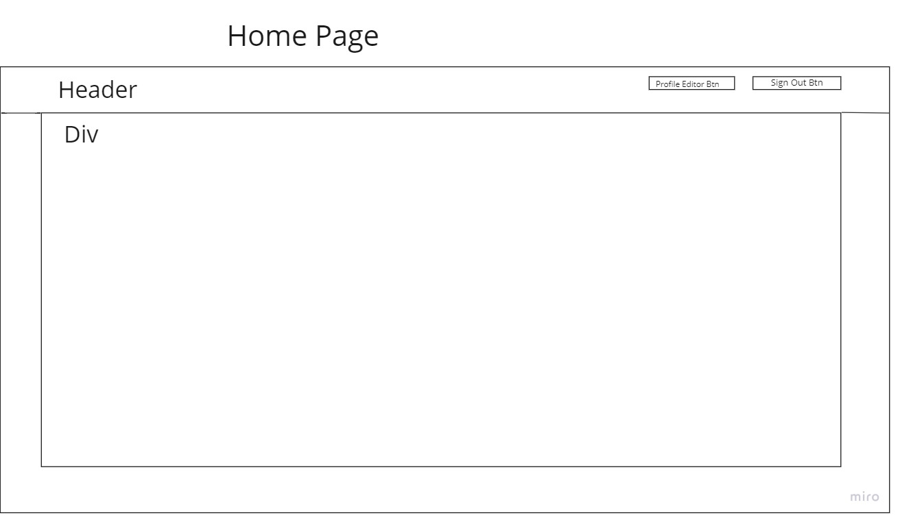
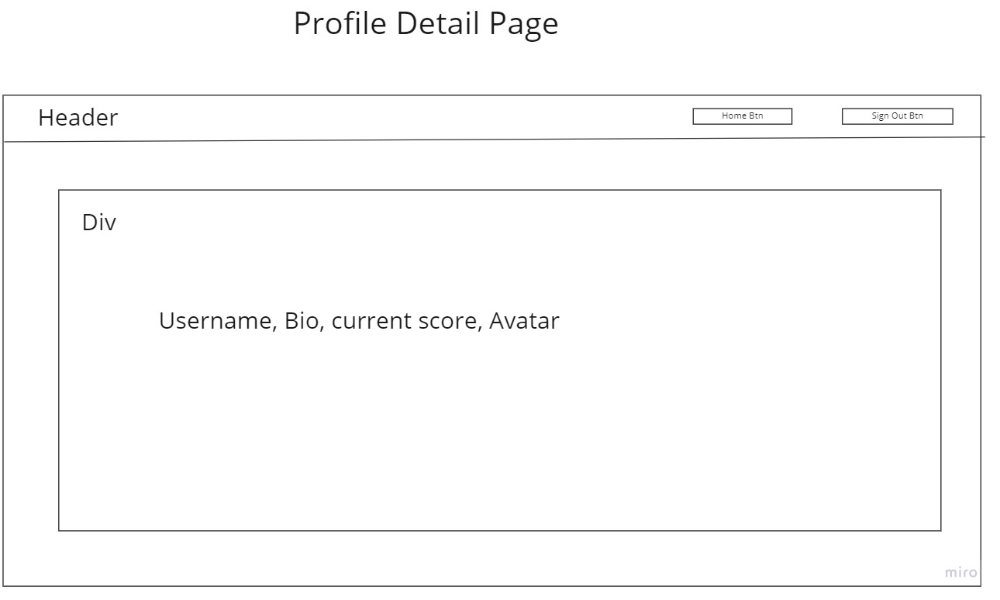
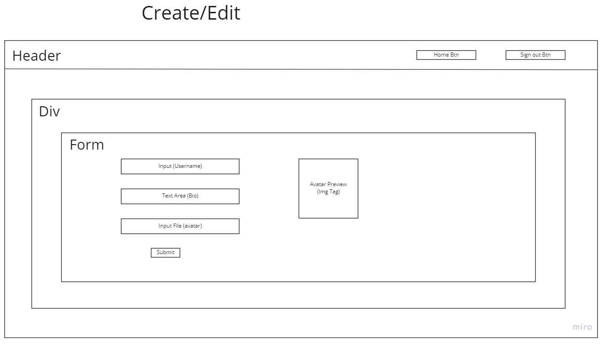

# Plan

## Table

-   profiles table
-   id
-   user_id (fkey to users table)
    -username (can use email)
-   bio
-   stars/popularity
-   avatar_url

## Pages

-   profile editor/creator
-   profile list (home page)
-   profile detail

### HTML

-   editor page:
-   form (input with label for username)
-   bio
-   avatar
-   image (preview of avatar)
-   button
-   p tag for error display
-   profile list
-   container that is hard coded
-   profile details:
-   hard code image and header
    = stars detail container

### Events

-   editor page:
-   page load
-   getting profile form info from supabase and display on form (if exists)
-   avatar image input ( 'on change') display on preview
-   form submit
-   utilize user input and send to supabase
-   upsert to send to supabase
-   error handling to display issues to users
-   profile page:
-   upvote/ downvote button click with increment/decrement star count in supabase
-   page load fetch

### functions

-   upload image (imagePath, imageFile)
-   upsert profile(profile)
-   get profile (user_id and getProfileById)(id)
    increment/ decrement stars by profile id

### slices

-   create/edit profile (username and bio)
-   add in avatar upload to profile
-   get profile from supabase (use it to fill in form)
-   error handling and button disable
-   profile list
-   profile detail page and stars up/down votes

[] On the profiles page load, fetch the profiles from supabase and render them to the page. Each profile should contain a link to that profile's detail page (using query params) 2

[] On the profile detail page load, use the query param to fetch the correct profile and display the email or username of the profile to the user 2

[] On the profile detail page load, display the popularity of the user 2
On the profile detail page, when the user upvotes or downvotes the profile, the popularity is updated correctly and displayed to the user 4

Functions

[] PURE: renderPopularityEl(profile) : takes in profile and returns a DOM element with karma and buttons (with event listeners to increment and decrement karma) 1

[] ASYNC: upsertProfile() : creates or updates a profile in supabase 2

[] ASYNC: getProfile(id) : takes in id and returns profile with matching id, including its related messages 1

[] ASYNC: incrementPopularity(id) and decrementPopularity(id) : takes in id of profile to update, fetches that profile to find current Popularity, then updates that profile appropriately
